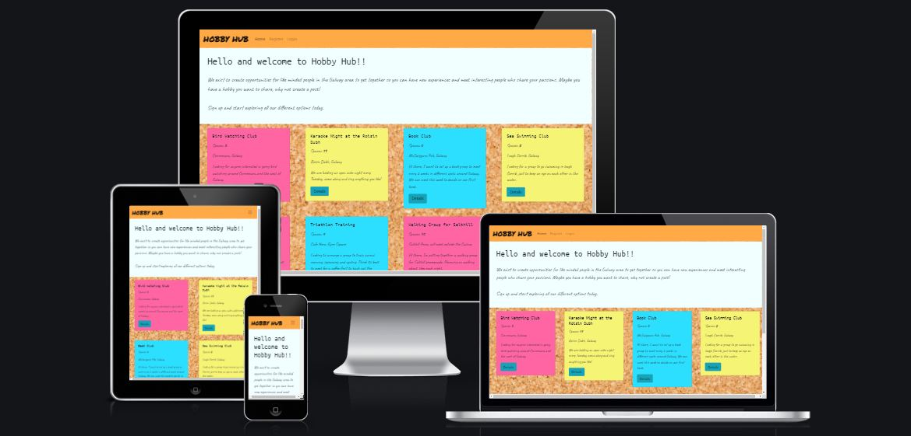
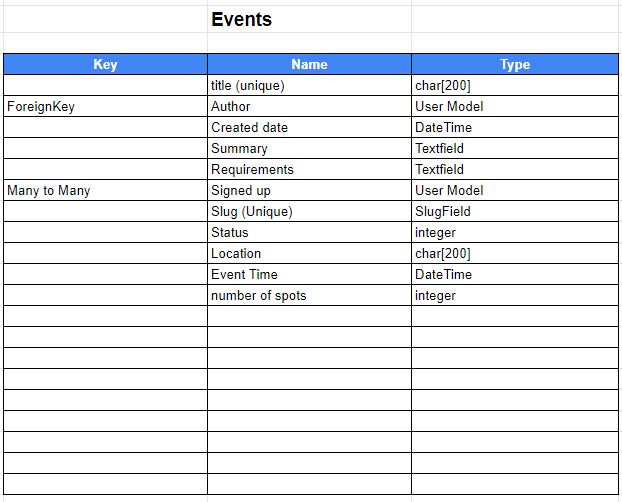
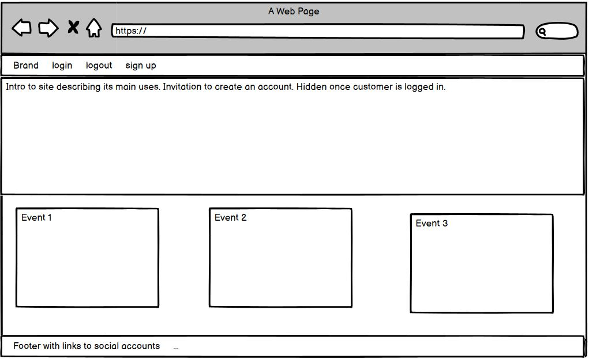
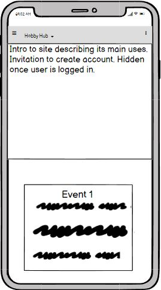
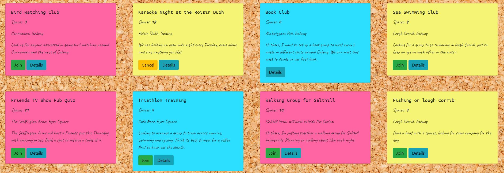
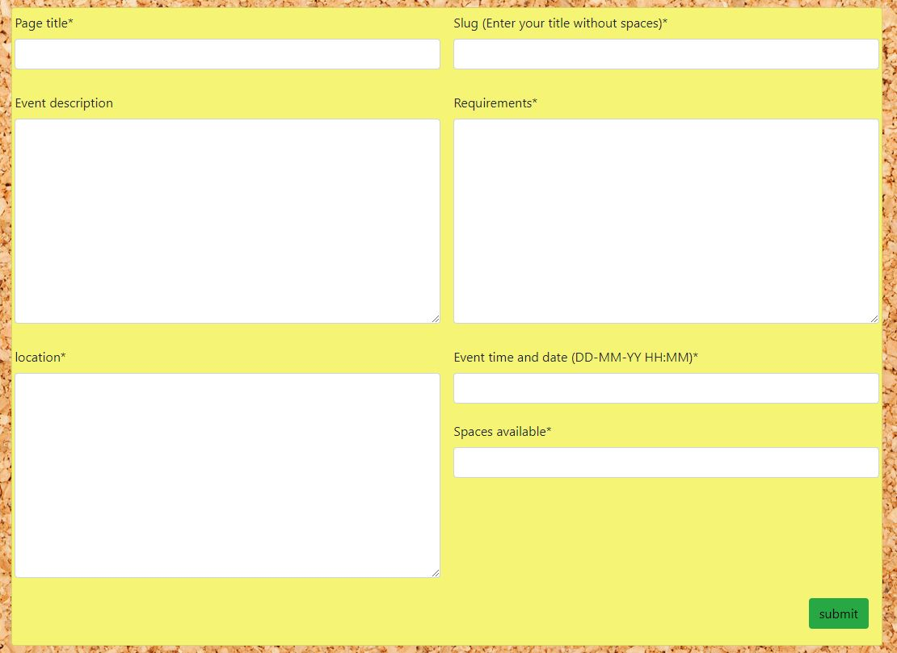

# [Hobby Hub](https://noticeboard2021.herokuapp.com/)

## Table of Contents
1. [**UX**](#ux)
    - [**User Stories**](#user-stories)
    - [**Design**](#design)
        - [**Framework**](#framework)
        - [**Color Scheme**](#color-scheme)
        - [**Typography**](#typography)
        - [**Data Model**](#data-model)
    - [**Wireframes**](#wireframes)

2. [**Features**](#features)
    - [**Existing Features**](#existing-features)
    - [**Future Features**](#future-features)

3. [**Testing**](#testing)
    - [**Validators**](#validators)
    - [**Known Issues**](#known-issues)

4. [**Deployment**](#deployment)
    - [**Heroku Deployment steps**](#heroku-deployment-steps)
    - [**Forking the GitHub Repository**](#forking-the-github-repository)

5. [**Credits**](#credits)
    - [**Content**](#content)
    - [**Acknowledgements**](#acknowledgements)

---

## UX

For this project, I decided to build a web application that allows users to find or post events in their area. I settled on this idea as the Covid pandemic has made it more difficult to meet new people. This application allows users to easily link up with like minded individuals by joining events.  

### User Stories

"**_As a user, I would like to_** _____________________________"

- Navigate the site using a navbar and footer.
- Sign into an account.
- View events.
- Post events.
- Register for an event.
- View the number of spots remaining on an event.
- Filter available events.
- Draft events. 

### Design

When deciding on the design, I wanted to create an informal and inviting space to encourage interaction from users. I aimed to style the events as post it notes on a pin board to create a familiar feel for users. 

#### Framework

- [Bootstrap 4.4.1](https://www.djangoproject.com/)

- [Django 3.2](https://www.djangoproject.com/)
  
#### Color Scheme

I selected the colours closest to the colours of post it notes for the event cards and then picked a warm colour for the nav and footer to frame the page. 

#### Typography

The Google Font of Caveat was first selected as tbe main font for this site as it gave the appearance of a hand written note on the cards which was in keeping with the informal design. I then selected Ubuntu Mono for the headers as I found this complimented Caveat.

The Hobby Hub logo is the Google Font Permanent Marker which I felt was a very strong font that also met the design plan. 

#### Data Model

### Wireframes

Main page wireframe

Mobile main page wireframe

## Features

**Navbar**

Navbar set at top of each page to allow the user to easily navigate the site. Made collapsible with Bootstrap to allow a better format for mobile users.

**Event List Page**

### Existing Features

Event List displays all events ordered by the publishing date and gives the options to interact with the events listed.

* All events contain a details button so users can see more information about an event. Clicking this button opens a modal containing all information.
* A join button is displayed when a user is signed in and is not the author of the event, this button is hidden is the spots number reaches zero. Clicking this button also reduces the number of spots by one.
* A cancel button is displayed if the user has joined the event. This changes the boolean status of the user attending the event and increases the event spots number by one.
* A delete button is only visible on the card if you are the author of the event.

**Event Form Page**

Event Form Page allows the user to post a new event to the site.

* Created using Crispy Form for styling.
* Formatted with Bootstrap rows and columns to allow it to be responsive for mobile and computer screens. 

### Future Features

* A search bar to allow the user to narrow down the events list.
* An option for authors of a post to edit the post details once submitted.

## Testing

I have thoroughly tested the features of Hobby Hub web application againt all user stories, I have also tested the web app on different screen sizes using google developer tools to ensure it is responsive for mobile and desktop devices.

USER STORY: Draft Events

<i>As a admin I can create an event and save it so that I can return and update details before posting on site.</i>

* I tested this user story by accessing and editing all details on a post once created through django admin. I was able to create events the admin panel and also through the web app once logged in.

Conclusion: Passed

---

USER STORY: Navbar and footer template

<i>As a user I can easily navigate to internal and external links so that I can login/logout and view external social media pages.</i>

* I have tested this user story by clicking all links in all features of the site to ensure they function as intended. The links are clearly labelled so the user can quickly understand each link's purpose. 

Conclusion: Passed

---

USER STORY: View number of spots available

<i>As a User I can view the number of spots left at an event so that I can see if it is popular and whether the event has enough space for a group to sign up.</i>

* I have tested this user story by ensuring each event displays the number of spots available. When an event is joined the number of spots decreased by one and increases by one when you cancel. I have also tested to ensure the join button is not available unless there is spaces available.

Conclusion: Passed

---

USER STORY:

<i></i>

Conclusion:

---

USER STORY:

<i></i>

Conclusion:

---

USER STORY:

<i></i>

Conclusion:

---

USER STORY:

<i></i>

Conclusion:

### Validators

### Known Issues

## Deployment 

### Heroku Deployment steps
 
 1. Ensure all dependencies are listed on requirements.txt. 
 
 Write on python terminal ` pip3 freeze > requirements.txt`, and a list with all requirements will be created to be read by Heroku. 
 
 2. Setting up your Heroku

    2.1 Go to Heroku website (https://www.heroku.com/). 
    
    2.2 Login to Heroku and go to Create App.
    
    2.3 Click in New and Create a new app.
    
    2.4 Choose a name and set your location.

    2.5. Navigate to the Resources tab.

    2.6. Click on Resources and Seach for Heroku Postgres and select it on the list.
    
    2.7. Navigate to the deploy tab.
    
    2.8. Click in Connect to Github and search for 'Gwgjnr' GitHub account and 'project_four' repository.
    
    2.9.  Navigate to the settings tab.
    
    2.10.  Click on Config Vars, and add your Cloudinary, Database URL (from Heroku-Postgres) and Secret key.

 3. Deployment on Heroku

    3.1.  Navigate to the Deploy tab.
        
    3.2.  Choose the main branch to deploy and enable automatic deployment to build Heroku every time any changes are pushed on the repository.
        
    3.3 Click on manual deploy to build the App.  When complete, click on View to redirect to the live site. 
    
### Forking the GitHub Repository

* By forking the GitHub Repository, you will be able to make a copy of the original repository on your own GitHub account, allowing you to view and/or make changes without affecting the original repository by using the following steps:

    Log in to GitHub and locate the GitHub Repository
    At the top of the Repository (not top of page), just above the "Settings" button on the menu, locate the "Fork" button.
    You should now have a copy of the original repository in your GitHub account.

* Making a Local Clone

    Log in to GitHub and locate the GitHub Repository
    Under the repository name, click "Clone or download".
    To clone the repository using HTTPS, under "Clone with HTTPS", copy the link.
    Open Git Bash
    Change the current working directory to the location where you want the cloned directory to be made.
    Type git clone, and then paste the URL you copied in Step 3.

$ git clone https://github.com/Gwgjnr/project_four

Press Enter. Your local clone will be created.

## Credits
